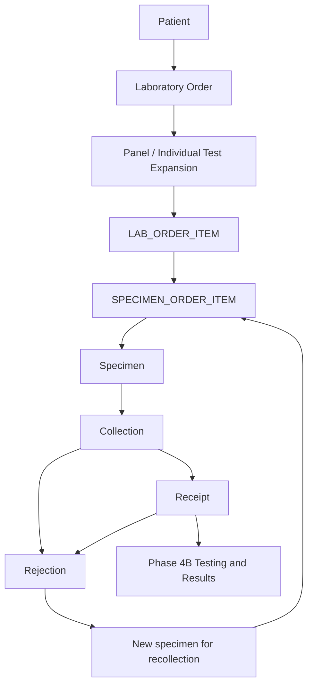

# Phase 4A — Laboratory orders, payments and specimens

Phase 4A uses the existing Phase 2C tables without a migration or model change.
It adds 15 protected API operations and 11 bootstrap permissions. Results,
interpretation, verification, completion, reports and blockchain runtime remain
outside this phase. Nothing automatically populates `LAB_ORDER.diagnosis`.

## Workflow and requested-test provenance



`LAB_ORDER_ITEM` is the central requested-test entity. Each requested panel
creates one `ORDER_PANEL`, then one item for **every** current `PANEL_TEST`,
including members with `is_required=false` and members in inactive sections.
Sections are presentation configuration and do not remove requested tests.
Each expanded item links to its source `order_panel_id`. Individual requests
create separate items with `order_panel_id=null`.

Two panels containing the same test create two distinct items. An individual
request for that test creates another item. There is no deduplication across
request sources. The initial order, panels and items all have `REQUESTED` status.
Later configuration changes do not rewrite the items in existing orders. Test
and panel names in summaries reflect the current master records; this phase
does not add historical name snapshots.

## API and permissions

All paths below are relative to `/api/v1`. New rows return 201, other successful
operations return 200. Existing cookie authentication, CSRF protection and
`Cache-Control: no-store` apply. Every unsafe operation requires the current
session's `X-CSRF-Token`. GET requests never mutate workflow records.

| Method | Path | Permission |
| --- | --- | --- |
| POST | `/lab-orders` | `LAB_ORDER_CREATE` |
| GET | `/lab-orders` | `LAB_ORDER_READ` |
| GET | `/lab-orders/{order_id}` | `LAB_ORDER_READ` |
| POST | `/lab-orders/{order_id}/cancel` | `LAB_ORDER_CANCEL` |
| POST | `/lab-orders/{order_id}/payments` | `PAYMENT_RECORD` |
| GET | `/lab-orders/{order_id}/payments` | `PAYMENT_READ` |
| POST | `/lab-orders/{order_id}/specimens` | `SPECIMEN_REGISTER` |
| GET | `/lab-orders/{order_id}/specimens` | `SPECIMEN_READ` |
| GET | `/specimens/{specimen_id}` | `SPECIMEN_READ` |
| POST | `/specimens/{specimen_id}/collect` | `SPECIMEN_COLLECT` |
| POST | `/specimens/{specimen_id}/receive` | `SPECIMEN_RECEIVE` |
| POST | `/specimens/{specimen_id}/reject` | `SPECIMEN_REJECT` |
| POST | `/lab/rejection-reasons` | `REJECTION_REASON_MANAGE` |
| GET | `/lab/rejection-reasons` | `REJECTION_REASON_MANAGE` |
| PATCH | `/lab/rejection-reasons/{rejection_reason_id}` | `REJECTION_REASON_MANAGE` |

The existing `app.cli.bootstrap_permissions` adds missing permissions
idempotently and preserves existing metadata and role grants. The catalog now
has 35 permissions (24 from earlier phases, 11 from Phase 4A). Bootstrap grants
nothing automatically. Active `SYSTEM_ADMIN` retains its existing permission
bypass. Other roles need explicit grants through the existing administrative
process. No permissions are seeded through Alembic.

As required by the aggregate order-detail contract, `LAB_ORDER_READ` grants
access to the order's embedded payment and specimen history. The dedicated
history endpoints use `PAYMENT_READ` and `SPECIMEN_READ`. Consider that aggregate
scope when assigning roles. Creating an order returns its initial detail;
other mutations return their own entity's dedicated response contract.

Errors follow the existing API: 401 missing/invalid authentication, 403 missing
permission or invalid CSRF, 404 missing path entity, 422 invalid request fields,
missing related entities or cross-order items, 409 business/configuration/unique
conflict, and generic 503 for unexpected database failures. PrivateRoute never
echoes submitted validation values or SQL error details.

## Order creation and reading

`patient_id` and exact `priority` (`ROUTINE`, `STAT`, `URGENT`) are required.
At least one of `panel_ids` or `test_ids` must be nonempty. Both default to empty
arrays and each accepts up to 1,000 IDs. Duplicate IDs within either array are
rejected. Every ID must resolve; an optional physician must exist and be active.
Requested panels and tests must be active. An empty active panel or a panel
containing an inactive test causes a controlled configuration conflict. No
configured panel component is silently omitted.

Optional fields are `physician_id`, `request_reason` (150 characters),
`clinical_notes` and `diagnosis` (16,000 characters each). Nullable fields accept
null. Text is trimmed and nonblank when provided. Diagnosis stores only text
supplied by the authorized caller; no range, rule or result is consulted.

Clients cannot set order ID/code, actor, order date, status or timestamps.
The actor is the authenticated user; timestamps are server UTC, stored as naive
UTC in existing MySQL DATETIME columns. Server-generated codes use
`LAB-YYMMDD-XXXXXXXXXXXXXXXXXX`, with 18 cryptographically random uppercase hex
characters (72 random bits) and length 29. Specimen codes use
`SP-YYMMDD-XXXXXXXXXXXXXXXXXX`, length 28. Neither code contains patient identity.
Uppercase hex retains its entropy under MySQL case-insensitive collation.
Database UNIQUE constraints are the final collision protection. A confirmed
code-constraint collision rolls back the entire operation and regenerates the
code, with at most three attempts; exhaustion returns 409. Other integrity
failures do not trigger code retries.

Order lists support `page`, `page_size`, `search`, `patient_id`, `physician_id`,
`priority`, `status`, `date_from` and `date_to`. Dates use `YYYY-MM-DD` in UTC,
with inclusive day boundaries; reversed bounds return 422. Search matches a
trimmed substring of order code, patient code, first name or last name (maximum
200 characters); SQL wildcard characters are escaped. Ordering is descending
`order_date`, then descending `order_id`.

All new list endpoints use:

```json
{"items": [], "page": 1, "page_size": 20, "total": 0}
```

`page >= 1`; `page_size` is 1–100 with default 20. Payment, specimen and rejection
reason lists sort by ascending primary key. Reason lists support `search` on
code/name and `is_active`. Totals are filtered before pagination. An out-of-range
page returns an empty items array. Patient-order queries are always paginated.

Order detail includes metadata, a minimal patient summary, an optional physician
summary, requested panels, all items with test summaries, payment history, and
specimens with mappings and rejections. Detail is complete for one order. Nested
specimen reads are batched to avoid one query per specimen. The response excludes
patient address/contact details, user credentials, sessions and all result data.
Payment arrays in detail sort by recorded time/ID; specimen arrays by creation
time/ID; panels/items/mappings by primary key; rejections by rejection time/ID.

## Cancellation

Cancellation requires a nonblank reason of at most 500 characters. It accepts
`REQUESTED` and `IN_PROGRESS` orders. Already `CANCELLED` and `COMPLETED` orders
return 409. The order becomes `CANCELLED`; each non-completed panel and item
becomes `CANCELLED`. Completed children retain their status.

Cancellation never deletes specimens, mappings, payments or prior rejection
history. The bounded reason is stored as a JSON value in the existing audit row;
no cancellation-reason column is added. Staff should enter only the operational
reason, without credentials or unnecessary clinical information.

## Append-only payment history

`payment_status` is required and accepts exactly `PENDING`, `PAID`, `FREE`,
`WAIVED`, `SUBSIDIZED`. `amount` is optional/null because the existing schema
supports status-only records. When provided, it is a finite nonnegative Decimal,
at most 12 digits with two decimal places (`0.00` through `9999999999.99`).
Excess precision is rejected rather than silently rounded. Use decimal strings
in JSON; Decimal values serialize as strings. Optional `payment_method` is at
most 50 characters; `reference_number` is at most 80.

Each POST appends a new row with authenticated actor and server timestamp.
There is no update or delete operation. Multiple rows per order are expected;
the API does not infer a balance, a charge, a refund, or one final payment state.
A payment record may be appended to a cancelled/completed order to preserve
administrative history. Payment never gates specimen registration or collection.

## Specimen registration and compatibility

Registration requires an existing order, an active existing sample type, and
1–1,000 unique `order_item_ids`. Every item must belong to the path order.
Cancelled or completed orders/items cannot enter new specimen processing.
For each selected item's `test_id`, the service requires a matching
`TEST_SAMPLE_TYPE(test_id, sample_type_id)` row. A default sample marker does
not restrict selection; any configured allowed active sample type is valid.
Previously ordered tests need not still be active, but current sample
compatibility must hold. An incompatible item rejects the complete request.

The server creates one `SPECIMEN` in `PENDING` status and one
`SPECIMEN_ORDER_ITEM` for each selected item, atomically. Remarks are optional,
up to 16,000 characters. ID/code, workflow status, collection/receipt actors and
times, and creation timestamp are server-owned and rejected in request bodies.

An order may use multiple sample types across multiple specimens. One specimen
may map to multiple items. An item may have multiple specimens, including a
replacement after rejection; existing mappings are never overwritten.

## Lifecycle and recollection

| Trigger | Entity | Allowed transition / behavior |
| --- | --- | --- |
| Specimen registration | Order | `REQUESTED -> IN_PROGRESS` |
| Specimen registration | Selected items | `REQUESTED -> IN_PROGRESS` |
| First selected item starts processing | Its source panel | `REQUESTED -> IN_PROGRESS` |
| Collection | Specimen | `PENDING -> COLLECTED` |
| Receipt | Specimen | `COLLECTED -> RECEIVED` |
| Rejection | Specimen | `COLLECTED` or `RECEIVED -> REJECTED` |
| Order cancellation | Order and non-completed children | `REQUESTED` / `IN_PROGRESS -> CANCELLED` |

The centralized `start_processing` service controls registration progress.
Unselected items and unrelated panels remain unchanged. Rejection does not
rewind item/panel/order status; processing has begun and may require recollection.
No operation marks an order, item or panel `COMPLETED`, or a specimen `PROCESSED`.
These transitions belong to Phase 4B.

Collection and receipt store authenticated actor and server UTC timestamp.
Repeated collection/receipt and every other invalid transition return 409.
Collection/receipt are blocked after order cancellation/completion.

Rejection requires an active existing reason and explicit
`recollection_required`; optional `details` accepts up to 16,000 characters.
It appends `SPECIMEN_REJECTION` with actor/time and sets the specimen to
`REJECTED` in one transaction. PENDING registrations cannot be rejected; the
sample must first be collected. Already rejected and processed specimens cannot
be rejected again. Quality history may still be recorded for an existing
collected/received specimen after its order is cancelled or completed; this
never resumes processing or changes the order status.

Rejection reasons have code (40 characters), name (120), optional description
(16,000), and `is_active` (default true). Duplicate codes return 409 on create or
PATCH. Deactivation preserves references. PATCH cannot null required fields;
an empty PATCH follows existing conventions and is audited. No DELETE exists.

For recollection, register a **new** specimen mapped to the same items, then
collect and receive it normally. The rejected specimen, code, rejection event
and mappings remain unchanged. There is no overwrite/reuse mechanism or
special recollection endpoint. Recollection cannot bypass a cancelled order.

## Transactions, concurrency and audits

Every mutation uses the existing transaction context. Authentication SELECTs
may already have begun the request transaction; the service owns one commit,
including the audit write. Validation, child rows, status changes and response
validation all complete before that commit. Every exception rolls back.
This covers order creation/expansion, cancellation, payment insertion, specimen
registration/mappings, collection/receipt, rejection, and reason administration.

All mutations of an existing order or its specimens acquire the order's
`FOR UPDATE` lock first. Transitions discover the immutable specimen parent ID,
then lock/reload the order and specimen before inspecting current states.
Related configuration uses shared current reads. Panel parents are locked before
reading composition; test locks coordinate sample validation with Phase 3C
mapping replacement. Locking reads refresh ORM state and avoid stale decisions
from authentication's earlier MySQL REPEATABLE READ snapshot. Mutation response
queries also use current reads; read-only details use the request's consistent
snapshot. Direct database writers must preserve these invariants too.

The existing bounded retry helper retries an entire rolled-back mutation for
MySQL deadlock-victim error 1213 (three attempts). Generated-code collisions have
the separate bounded retry described above. Unknown database errors, uncertain
connection/commit failures and exhausted deadlock retries are not replayed
indefinitely and use the existing generic database-failure response.

Successful workflow actions emit:

```text
LAB_ORDER_CREATE       LAB_ORDER_CANCEL
PAYMENT_RECORD
SPECIMEN_REGISTER      SPECIMEN_COLLECT
SPECIMEN_RECEIVE       SPECIMEN_REJECT
REJECTION_REASON_CREATE
REJECTION_REASON_UPDATE
```

Events record actor, entity/record ID, server time and validated client IP.
Payloads contain status changes, relevant association IDs or changed field
names. Cancellation additionally records its required bounded reason. Full
patient records, clinical notes, diagnosis, payment references, specimen remarks,
rejection details and reason descriptions are not copied into audit payloads.
Passwords, session and CSRF tokens are never deliberately included. The audit
insert is part of the mutation: failed auditing cannot leave a successful action.

## Synthetic API examples

The IDs below represent synthetic records already created through the Phase 3
APIs. Replace them with IDs returned by your synthetic setup. Do not assume the
same IDs identify appropriate records in production. Use an authorized session
cookie jar and the current session's CSRF token.

```bash
LABCHAIN_URL=https://labchain.online
LABCHAIN_JAR=/tmp/labchain-synthetic.cookies
# Set LABCHAIN_CSRF from the current synthetic session's rhu_csrf cookie.

curl --fail-with-body -b "$LABCHAIN_JAR" \
  -H "X-CSRF-Token: $LABCHAIN_CSRF" -H 'Content-Type: application/json' \
  -d '{"patient_id":1,"physician_id":2,"priority":"ROUTINE","request_reason":"Synthetic examination","clinical_notes":"Synthetic example","diagnosis":null,"panel_ids":[1],"test_ids":[7,8]}' \
  "$LABCHAIN_URL/api/v1/lab-orders"

# Set LABCHAIN_ORDER_ID and LABCHAIN_ITEM_IDS from the returned order/items.
# LABCHAIN_ITEM_IDS is a JSON integer array, e.g. [10,11,12].
curl --fail-with-body -b "$LABCHAIN_JAR" \
  "$LABCHAIN_URL/api/v1/lab-orders?page=1&page_size=20&priority=ROUTINE&date_from=2026-09-16"

curl --fail-with-body -b "$LABCHAIN_JAR" \
  -H "X-CSRF-Token: $LABCHAIN_CSRF" -H 'Content-Type: application/json' \
  -d '{"payment_status":"PAID","amount":"350.00","payment_method":"CASH","reference_number":null}' \
  "$LABCHAIN_URL/api/v1/lab-orders/$LABCHAIN_ORDER_ID/payments"

curl --fail-with-body -b "$LABCHAIN_JAR" \
  -H "X-CSRF-Token: $LABCHAIN_CSRF" -H 'Content-Type: application/json' \
  -d "{\"sample_type_id\":1,\"order_item_ids\":$LABCHAIN_ITEM_IDS,\"remarks\":null}" \
  "$LABCHAIN_URL/api/v1/lab-orders/$LABCHAIN_ORDER_ID/specimens"

# Set LABCHAIN_SPECIMEN_ID from that response.
curl --fail-with-body -X POST -b "$LABCHAIN_JAR" \
  -H "X-CSRF-Token: $LABCHAIN_CSRF" \
  "$LABCHAIN_URL/api/v1/specimens/$LABCHAIN_SPECIMEN_ID/collect"
curl --fail-with-body -X POST -b "$LABCHAIN_JAR" \
  -H "X-CSRF-Token: $LABCHAIN_CSRF" \
  "$LABCHAIN_URL/api/v1/specimens/$LABCHAIN_SPECIMEN_ID/receive"

curl --fail-with-body -b "$LABCHAIN_JAR" \
  -H "X-CSRF-Token: $LABCHAIN_CSRF" -H 'Content-Type: application/json' \
  -d '{"reason_code":"SYNTH-CLOTTED","reason_name":"Synthetic clotted specimen","is_active":true}' \
  "$LABCHAIN_URL/api/v1/lab/rejection-reasons"
# Set LABCHAIN_REASON_ID from that response.
curl --fail-with-body -b "$LABCHAIN_JAR" \
  -H "X-CSRF-Token: $LABCHAIN_CSRF" -H 'Content-Type: application/json' \
  -d "{\"rejection_reason_id\":$LABCHAIN_REASON_ID,\"details\":\"Synthetic clotted specimen\",\"recollection_required\":true}" \
  "$LABCHAIN_URL/api/v1/specimens/$LABCHAIN_SPECIMEN_ID/reject"

# Recollection: repeat registration with the same item IDs to create a NEW specimen.
curl --fail-with-body -b "$LABCHAIN_JAR" \
  "$LABCHAIN_URL/api/v1/lab-orders/$LABCHAIN_ORDER_ID"

# Optional separate cancellation example:
curl --fail-with-body -b "$LABCHAIN_JAR" \
  -H "X-CSRF-Token: $LABCHAIN_CSRF" -H 'Content-Type: application/json' \
  -d '{"reason":"Patient withdrew request"}' \
  "$LABCHAIN_URL/api/v1/lab-orders/$LABCHAIN_ORDER_ID/cancel"
```

## Verification and Hostinger deployment

Verified on 2026-09-16: **549 passed, 0 failed, 0 skipped** in 326.41 seconds.
This includes 147 new Phase 4A tests: 137 API/service cases and 10 native MySQL
scenarios. All earlier-phase regressions passed. Two pre-existing
Starlette/httpx and AnyIO deprecation warnings remain. `pip check` passed;
Alembic has one head, `20260915_01`. All 23 tracked model, migration, deployment,
environment-example and dependency files checked against HEAD are byte-for-byte
unchanged, with exactly five migration files. No migration was added, and no
production deployment or production permission bootstrap was executed.

The Phase 4A suite covers authentication/permission/CSRF on every route, expansion
provenance, validation, exact enums, generated codes, pagination/search/filters,
append-only payment history, compatibility, lifecycle/recollection, audit privacy,
and injected database/audit/commit failures. Disposable MySQL probes additionally
exercise concurrent transitions, registration versus cancellation, old snapshots,
actual unique-code collisions/retries, native Decimal and transaction rollback.
The full suite includes all Phase 2/3 regressions, health/readiness, OpenAPI,
workbook/schema constraints, frozen migration hashes and one Alembic head.

Tests block production networking and substitute synthetic settings. Native MySQL
probes use the existing isolated `/tmp/rhu-phase3b-mysql-*` harness with
`--no-defaults`, a private data directory and Unix socket, `--skip-networking`,
and MySQL X disabled. They remove their disposable database/server afterward.
If `mysqld` is unavailable, these probes skip; a skip is not MySQL verification.

Run these commands as `rhuadmin` from the reviewed Phase 4A checkout already
delivered to `/opt/rhu-labchain`. Execute one command at a time and stop on
failure. These are deployment instructions; implementation/testing does not
bootstrap production permissions or restart the live service.

```bash
cd /opt/rhu-labchain
.venv/bin/python -m pip check
.venv/bin/python -m pytest -q
.venv/bin/alembic heads
.venv/bin/alembic current
# Both must identify 20260915_01 before continuing.
.venv/bin/python -m app.cli.bootstrap_permissions
sudo systemctl restart rhu-labchain-node1
sudo systemctl is-active rhu-labchain-node1
curl --fail --silent --show-error --max-time 15 https://labchain.online/api/v1/health
curl --fail --silent --show-error --max-time 15 https://labchain.online/api/v1/ready
curl --fail --silent --show-error --max-time 15 https://labchain.online/openapi.json -o /tmp/labchain-phase4a-openapi.json
.venv/bin/python -c 'import json; p=json.load(open("/tmp/labchain-phase4a-openapi.json"))["paths"]; assert "post" in p["/api/v1/lab-orders"]; assert "post" in p["/api/v1/specimens/{specimen_id}/reject"]; assert "patch" in p["/api/v1/lab/rejection-reasons/{rejection_reason_id}"]; print("Phase 4A OpenAPI verified")'
```

No `alembic upgrade` is needed. No dependency change is required. Existing
migrations, schema/model files, production `.env`, Nginx, Certbot, UFW and
systemd definitions are unchanged. The restart loads the reviewed code through
the existing service definition. Assign new non-admin grants deliberately after
bootstrap. Phase 4A ends here; do not proceed to result APIs automatically.
