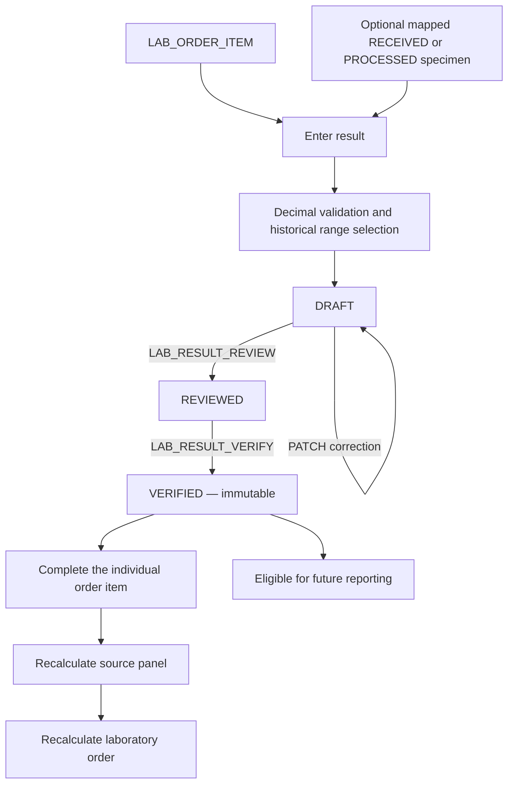

# Phase 4B — Laboratory results, flags, review and verification

Phase 4B uses the existing `LAB_RESULT_ITEM` and workflow schema. No table,
column, constraint or migration is added. Results remain independent of
`LAB_REPORT`: a verified result becomes eligible for future reporting, but this
phase creates no reports, snapshots, PDFs, releases or signatures.

**Reference-range flags are not medical diagnoses.** The implementation never
populates `LAB_ORDER.diagnosis`, attaches interpretation-rule text, or generates
disease names, treatment plans or prescriptions.



## API and RBAC

All paths below are relative to `/api/v1`. POST creation returns 201; reads,
PATCH, review and verification return 200. There is no DELETE endpoint.

| Method | Path | Permission |
| --- | --- | --- |
| POST | `/lab-order-items/{order_item_id}/result` | `LAB_RESULT_ENTER` |
| GET | `/lab-orders/{order_id}/results` | `LAB_RESULT_READ` |
| GET | `/results/{result_item_id}` | `LAB_RESULT_READ` |
| PATCH | `/results/{result_item_id}` | `LAB_RESULT_ENTER` |
| POST | `/results/{result_item_id}/review` | `LAB_RESULT_REVIEW` |
| POST | `/results/{result_item_id}/verify` | `LAB_RESULT_VERIFY` |

The existing idempotent permission bootstrap gains these four codes. Its total
catalog now has 39 entries. It inserts missing permissions without changing
existing metadata or grants; it does not grant new permissions automatically.
Active `SYSTEM_ADMIN` retains its existing permission bypass. Other roles need
explicit grants through the established administrative process.

Existing opaque session authentication, CSRF protection on unsafe methods, and
`Cache-Control: no-store` apply to all six routes. GET requires no CSRF token.
OpenAPI uses the `Laboratory Results` tag and dedicated Pydantic contracts.
Submitted invalid fields, request values and database errors are not echoed.

The encoder, reviewer and verifier may be the same authorized person. Stricter
separation of duties is a future configurable governance policy; it is not a new
hard rule in Phase 4B.

## One current result per requested item

Phase 4B allows **at most one `LAB_RESULT_ITEM` per `LAB_ORDER_ITEM`**. POST
returns 409 when any result already exists for that item, regardless of status.
The application enforces this under locks. The database intentionally retains
its ability to hold multiple rows: no UNIQUE constraint is added.

Existing duplicate rows remain readable, but this phase rejects their mutation
with a controlled conflict rather than selecting an arbitrary current result.
Repeat/referral attempts and result replacement are not implemented. Future
repeat/referral writers must introduce a controlled policy and coordinate with
the existing order/item lock convention.

Each requested item remains independent. Overlapping panel tests and individual
requests for the same test require their own results and complete separately.
There is no deduplication by `test_id`.

## Entry and value validation

POST accepts only:

```json
{"specimen_id":15,"result_value":"12.60","remarks":null}
```

`result_value` is required, trimmed, nonblank text of at most 100 characters.
`specimen_id` is optional/null and otherwise a positive BIGINT identifier.
`remarks` is optional/null, trimmed nonblank text up to 16,000 characters.
Unknown fields are rejected, including IDs, numeric value, range ID, flag,
status, and every encoding/review/verification actor or timestamp.

The path item and its test must exist. The item and parent order must not be
cancelled. The service checks the one-result invariant before creating a row.
An already ordered test need not remain active in the catalog; its current
`result_type` controls value validation.

| Test type | Validation | Stored numeric value |
| --- | --- | --- |
| `NUMERIC` | Finite decimal text representable exactly in DECIMAL(12,3) | Parsed Decimal with three decimal places |
| `TEXT` | Any permitted nonblank text | NULL |
| `POS_NEG` | Any permitted nonblank text | NULL |

NUMERIC accepts ASCII decimal notation, optional signs and exponent notation
when the final value fits. It rejects units, commas, underscores, nonnumeric
text, NaN, infinity, and values requiring rounding. Bounds are
`-999999999.999` through `999999999.999`. Extra trailing zeroes are allowed
because they do not lose precision; nonzero digits beyond the third decimal
place are rejected. JSON numbers/floats are not accepted for `result_value`.
All parsing, storage preparation, age arithmetic and flag comparisons use
Decimal, never binary float.

The display text is preserved after trimming. For example, input `" 12.60 "`
stores `result_value="12.60"` and `numeric_value=Decimal("12.600")`.
Decimal values serialize as JSON strings. POS_NEG is deliberately not restricted
to Positive/Negative: Reactive, Non-reactive, Detected, Not detected and other
approved qualitative text are valid.

Creation stores DRAFT status, the authenticated encoder and server UTC timestamp.
Review and verification provenance starts null. Encoding provenance is preserved
by all later PATCH/review/verification operations; subsequent actors are recorded
in the audit history and their dedicated review/verification fields.

## Specimen integrity and processing

A null specimen is valid because the normalized schema explicitly permits it.
When supplied, a specimen must exist, belong to the same laboratory order, and
be mapped to the exact requested item through `SPECIMEN_ORDER_ITEM`.

Only `RECEIVED` and `PROCESSED` specimens may be used. `PENDING`, `COLLECTED`
and `REJECTED` are rejected. The test/sample compatibility decision was made
when the specimen was registered; result integrity checks its accepted workflow
status and actual item mapping rather than reinterpreting later master-data
sample-assignment changes.

The first result attached to a received specimen sets it to `PROCESSED` in the
same transaction. An already processed specimen stays processed and can supply
more results for its mapped items. **PROCESSED means the accepted specimen has
entered testing; it does not mean all its results are complete.** A draft PATCH
that attaches a different received specimen also marks that specimen processed.
Removing or changing a result's specimen never rewinds the old specimen's
processing history or deletes mappings.

Result entry uses the existing centralized `start_processing` helper to advance
REQUESTED items, their source panels and their order to IN_PROGRESS. Entry and
review do not mark requested items completed.

## Historical age and reference-range resolution

Entry follows `LAB_ORDER_ITEM -> LAB_ORDER -> PATIENT`. The centralized
`age_at_date` utility derives age from birth date and the **order date**, never
from today's date:

```text
age_years = Decimal(elapsed whole days) / Decimal("365.2425")
```

The calculation uses local Decimal precision of 40 digits without rounding to
the stored range bounds' two-decimal scale. Leap days are handled by date
subtraction. A birth date after the order date returns a controlled 422 instead
of guessing an age. Age is never stored on the patient.

The existing Phase 3C resolver is reused. Its internal contract now supports
unknown sex/age and optional current locking reads. The public Phase 3C resolver
endpoint keeps its existing required sex/age/date query contract.

Selection requires the same test, an active range, applicable inclusive age
bounds, and effective dates that include `LAB_ORDER.order_date.date()` in UTC.
Null range bounds mean unbounded. Sex preference remains:

| Patient sex | Applicable categories |
| --- | --- |
| M | Prefer M, then ANY |
| F | Prefer F, then ANY |
| Other | ANY only |
| NULL | ANY only |

Unknown birth date matches only ranges with **both age_min and age_max NULL**.
An exact-sex range that requires a known age cannot displace an applicable
unbounded ANY range. Sex is never inferred from a name or other fields.

Ambiguous equally applicable ranges retain the existing controlled 409 and
configuration-ID-only logging. When no range applies, result entry is allowed
with `reference_range_id=NULL` and `flag=NULL`. A matching range without usable
thresholds still supplies its pointer, but may yield a null flag.

## Flag algorithms

For numeric results, compare Decimal values in this exact order:

```text
if critical_low exists and value < critical_low:       CRITICAL_LOW
else if critical_high exists and value > critical_high: CRITICAL_HIGH
else if normal_low exists and value < normal_low:      LOW
else if normal_high exists and value > normal_high:    HIGH
else if either normal bound exists:                    NORMAL
else:                                                 NULL
```

Comparisons are strict at each threshold. Values equal to normal_low or
normal_high are NORMAL under these rules; equality at a critical threshold
falls through to the next applicable rule. Zero is a valid configured bound.

For TEXT and POS_NEG, if `qualitative_normal` exists, compare the trimmed display
text to the trimmed configured text with Unicode case folding. Equal means
NORMAL; unequal means ABNORMAL. Without configured normal text, the flag is NULL.
No interpretation rule participates in flag selection.

The stored numeric value, selected range ID and flag are server-owned. A range
ID is a pointer to mutable master configuration, **not a frozen copy of its
thresholds**. Result detail displays the current referenced range summary.
Stored derivations are recalculated on entry or an actual draft display-value
change; remarks-only or specimen-only corrections, review and verification do
not rewrite them when master data changes. Review/verification confirm that the
stored numeric value still matches its display value and current test type,
and that a referenced range belongs to the same test. A flag without a range
pointer is rejected as inconsistent. Range activity or demographic edits do not
silently rewrite previously encoded flags. True report snapshots are outside
this phase and require later reporting policy.

## Draft correction, review and verification

PATCH accepts only `result_value`, `specimen_id`, and `remarks`, and only on a
DRAFT result. Null may clear specimen or remarks; result_value cannot be null.
A changed result value is revalidated and reparsed, and the range and flag are
reselected using current configuration and historical order demographics.
Specimen changes undergo full mapping/order/status validation. The service also
checks the current specimen and stored value integrity on other draft edits.
An empty PATCH follows existing conventions and is audited with no changed fields.

| Action | Required state | Resulting state | Provenance written |
| --- | --- | --- | --- |
| Entry | No result for item | DRAFT | encoded_by / encoded_at |
| Review | DRAFT | REVIEWED | reviewed_by / reviewed_at |
| Verify | REVIEWED | VERIFIED | verified_by / verified_at |

Review and verification recheck order/item cancellation, result multiplicity,
specimen mapping/status, numeric consistency, range/test association, and stored
review/verification provenance. REVIEWED rows missing reviewer or review time,
and inconsistent pre-existing verification provenance, cause a controlled 409.
A DRAFT cannot be verified directly. Repeated transitions return 409. Review
never verifies automatically. REVIEWED and VERIFIED results cannot be PATCHed;
VERIFIED results are immutable through the API. There is no reset, unreview,
replacement or deletion endpoint. Inconsistent legacy/configuration data requires
controlled correction; the API does not silently repair historical results.

## Completion rules

Successful verification marks **that result's requested item** COMPLETED. It then
recalculates its source panel, when present, and the parent order. These steps
commit with verification and its audit event.

Panel status is determined from its own items, ignoring CANCELLED items:

1. At least one remaining item, all COMPLETED: COMPLETED.
2. Otherwise any remaining item IN_PROGRESS or COMPLETED: IN_PROGRESS.
3. Otherwise: REQUESTED.

A CANCELLED panel is never reactivated. An empty or entirely cancelled item set
does not satisfy completion.

Order completion examines every requested item, including individual requests
and independently expanded overlapping panel items. With at least one
non-cancelled item and all such items completed, the order becomes COMPLETED.
Otherwise an order whose processing has begun remains IN_PROGRESS. A CANCELLED
order is never reactivated. No paid status or payment record is required.

The original Phase 4A cancellation policy continues to preserve completed
children and specimen/result history. The common order lock coordinates
cancellation with result entry, review and verification. The existing Phase 4A
order detail remains result-free; results are read through LAB_RESULT_READ APIs.

## Reads, errors and transaction boundaries

Order result lists use `{items, page, page_size, total}` with page >= 1 and
page_size 1–100 (default 20). They sort by order_item_id then result_item_id.
Lists are scoped to one existing order, including preserved history for cancelled
orders, and out-of-range pages return empty items. Related summaries are fetched
in batches rather than once per result.

Responses include result metadata/value/flag/status, test summary, optional
specimen and range summaries, remarks and encoding/review/verification provenance.
Actor summaries contain only user_id and username. No password/security columns
are fetched by the result-summary queries, and no unrelated patient/account data
or interpretation text is returned.

Errors follow the project convention: 401 authentication, 403 permission/CSRF,
404 missing path entity, 422 invalid input or missing/cross-order/unmapped related
specimen, 409 lifecycle/configuration/integrity conflicts, and generic 503 for
unexpected database failures. An invalid request or failed audit must not leave
partially updated result/workflow records.

Every mutation uses the existing explicit transaction context and owns a single
commit, including its audit. Authentication may already have opened the request
transaction. The service discovers immutable parent IDs, then acquires the same
order FOR UPDATE lock used by Phase 4A, followed by current item/result locks.
The result-existence query is a current locking read even when the earlier
authentication snapshot saw no result. This enforces the application-only
one-result invariant under concurrent creation without a new database constraint.

All results within an order use the same order lock. Concurrent final verifications
therefore observe each other's item completion before recalculating parent state.
Specimen locks coordinate result entry with rejection. Shared test/patient/range
reads select current configuration under MySQL REPEATABLE READ. Completion writes
are flushed before current reads can refresh ORM objects. Response contracts are
validated before commit. The existing helper retries a fully rolled-back MySQL
1213 deadlock victim at most three times. Unknown errors and uncertain commit or
connection failures are not automatically replayed.

## Audit behavior

Successful mutations write these actions to the existing AUDIT_LOG:

```text
LAB_RESULT_CREATE
LAB_RESULT_UPDATE
LAB_RESULT_REVIEW
LAB_RESULT_VERIFY
```

Each event includes actor, entity/result ID, server time, validated request IP,
and minimal JSON such as order_item_id, status transitions, changed field names,
and flag transitions. Full result values, remarks, patient data, diagnosis,
clinical notes, passwords, and session/CSRF tokens are not copied into the audit.
Failure of the audit insert rolls back the result and all associated specimen,
item, panel and order changes.

## Synthetic API examples

Use synthetic setup and an authorized session. IDs must be obtained from the
actual synthetic order and specimen responses. The specimen is optional; if
provided, collect and receive it through Phase 4A before entry.

```bash
LABCHAIN_URL=https://labchain.online
LABCHAIN_JAR=/tmp/labchain-synthetic.cookies
# Set LABCHAIN_CSRF from the current synthetic session's rhu_csrf cookie.
# Set LABCHAIN_ITEM_ID, LABCHAIN_ORDER_ID and LABCHAIN_SPECIMEN_ID from setup.

curl --fail-with-body -b "$LABCHAIN_JAR" \
  -H "X-CSRF-Token: $LABCHAIN_CSRF" -H 'Content-Type: application/json' \
  -d "{\"specimen_id\":$LABCHAIN_SPECIMEN_ID,\"result_value\":\"12.60\",\"remarks\":null}" \
  "$LABCHAIN_URL/api/v1/lab-order-items/$LABCHAIN_ITEM_ID/result"

# Set LABCHAIN_RESULT_ID from the creation response.
curl --fail-with-body -b "$LABCHAIN_JAR" \
  "$LABCHAIN_URL/api/v1/lab-orders/$LABCHAIN_ORDER_ID/results?page=1&page_size=20"

curl --fail-with-body -X PATCH -b "$LABCHAIN_JAR" \
  -H "X-CSRF-Token: $LABCHAIN_CSRF" -H 'Content-Type: application/json' \
  -d '{"result_value":"12.70","remarks":"Synthetic draft correction"}' \
  "$LABCHAIN_URL/api/v1/results/$LABCHAIN_RESULT_ID"

curl --fail-with-body -X POST -b "$LABCHAIN_JAR" \
  -H "X-CSRF-Token: $LABCHAIN_CSRF" \
  "$LABCHAIN_URL/api/v1/results/$LABCHAIN_RESULT_ID/review"
curl --fail-with-body -X POST -b "$LABCHAIN_JAR" \
  -H "X-CSRF-Token: $LABCHAIN_CSRF" \
  "$LABCHAIN_URL/api/v1/results/$LABCHAIN_RESULT_ID/verify"

curl --fail-with-body -b "$LABCHAIN_JAR" \
  "$LABCHAIN_URL/api/v1/results/$LABCHAIN_RESULT_ID"
curl --fail-with-body -b "$LABCHAIN_JAR" \
  "$LABCHAIN_URL/api/v1/lab-orders/$LABCHAIN_ORDER_ID"
```

## Verification and Hostinger deployment

Verified on 2026-09-16: **720 passed, 0 failed, 0 skipped** in 462.17 seconds.
This includes 171 new Phase 4B tests: 161 API/calculation/service cases and 10
native MySQL scenarios. All earlier-phase tests passed. Two pre-existing
Starlette/httpx and AnyIO deprecation warnings remain. `pip check` passed and
Alembic retains the single head `20260915_01`. All 23 tracked model, migration,
deployment, environment-example and dependency files checked against HEAD remain
byte-for-byte unchanged, with exactly five migration files. No migration was
added. Production permissions were not bootstrapped and the service was not
restarted during development.

The Phase 4B tests cover protected routes, input allowlists, Decimal limits,
historical range selection/unknown demographics, exact flag boundaries,
specimen integrity, draft correction, review/verification provenance, independent
panel/individual completion, audit privacy and injected write/audit/commit failures.
Native MySQL probes cover duplicate creation, duplicate review/verification,
simultaneous completion of separate items, cancellation/rejection/patch races,
stale demographic/range snapshots, native Decimal precision and rollback.
The complete suite also runs all Phase 2/3/4A regressions and health/readiness,
OpenAPI, frozen migrations, schema contracts and single-head checks.

Tests replace application settings with synthetic configuration and block
production networking. MySQL probes use the established disposable
`/tmp/rhu-phase3b-mysql-*` private data directory and Unix socket harness with
`--no-defaults`, `--skip-networking` and MySQL X disabled. The database/server
are removed after testing. If mysqld is unavailable, native checks skip;
skips must not be reported as successful MySQL verification.

Run the following as `rhuadmin` from the reviewed Phase 4B checkout already
delivered to `/opt/rhu-labchain`. Execute commands one at a time and stop on
failure. These are deployment instructions, not actions executed during development.
No dependencies or schema migrations are needed.

```bash
cd /opt/rhu-labchain
.venv/bin/python -m pip check
.venv/bin/python -m pytest -q
.venv/bin/alembic heads
.venv/bin/alembic current
# Both must identify 20260915_01 before continuing.
.venv/bin/python -m app.cli.bootstrap_permissions
sudo systemctl restart rhu-labchain-node1
sudo systemctl is-active rhu-labchain-node1
curl --fail --silent --show-error --max-time 15 https://labchain.online/api/v1/health
curl --fail --silent --show-error --max-time 15 https://labchain.online/api/v1/ready
curl --fail --silent --show-error --max-time 15 https://labchain.online/openapi.json -o /tmp/labchain-phase4b-openapi.json
.venv/bin/python -c 'import json; p=json.load(open("/tmp/labchain-phase4b-openapi.json"))["paths"]; assert "post" in p["/api/v1/lab-order-items/{order_item_id}/result"]; assert "get" in p["/api/v1/lab-orders/{order_id}/results"]; assert "post" in p["/api/v1/results/{result_item_id}/verify"]; print("Phase 4B OpenAPI verified")'
```

Do not run `alembic upgrade` for this phase. Existing models/migrations, production
.env, Nginx, Certbot, UFW and systemd definitions remain unchanged. Bootstrap
permissions, then grant non-admin roles deliberately. The restart uses the existing
service definition. Phase 4B stops here; no reporting, repeat/referral workflow,
PDF, QR, portal, delivery, attachment, blockchain runtime or frontend is added.
