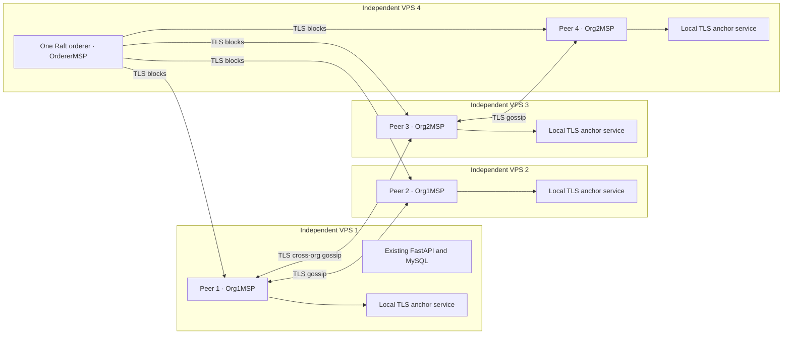

# Phase 8A — Four-VPS Hyperledger Fabric foundation

## Status and scope

Repository artifacts are implemented and validated offline. **The four-VPS network has not been deployed or demonstrated live.** Docker Engine and authorized access/inventory for four separate VPS hosts were not available during this work. Successful offline tests and generated channel blocks are not evidence of distributed transaction commitment. The live acceptance procedure below is still required to finish network bring-up.

Phase 8A creates infrastructure and a synthetic-test contract only. FastAPI, MySQL, `/ready`, report release, PDF integrity/QR semantics, staff/patient screens, and existing blockchain-support tables are unchanged. There is no Alembic migration. Laboratory operations have no Fabric dependency. MySQL remains the operational source of truth; its support tables are not a blockchain. Phase 8B will implement asynchronous application anchoring, canonical hashes and retry behavior. No production report has been anchored by this phase.

## Architecture and ownership



There is intentionally no application-to-Fabric arrow yet. Each peer receives blocks directly from the orderer; gossip bootstraps connect same-organization peers, and channel anchor peers are nodes 1 and 3.

| VPS | Fabric hostname | Peer identity | Organization | Additional roles |
|---|---|---|---|---|
| 1 | `node1.labchain.internal` | `peer1.org1.labchain.internal` | Org1MSP | Existing app host; Org1 admin operations |
| 2 | `node2.labchain.internal` | `peer2.org1.labchain.internal` | Org1MSP | Peer only |
| 3 | `node3.labchain.internal` | `peer3.org2.labchain.internal` | Org2MSP | Org2 admin operations |
| 4 | `node4.labchain.internal` | `peer4.org2.labchain.internal` | Org2MSP | Orderer and its local administration |

This is **two peer organizations, not four organizations**. OrdererMSP is a distinct ordering organization. Two MSPs provide meaningful policy separation only when their administrators and keys are separately controlled. One institution controlling both organizations and the offline bootstrap CAs remains an administrative trust concentration. Four hostnames/IPs alone do not prove four independent machines: record provider instance identifiers and the host fingerprints printed by preparation on four actual VPS instances.

## Versions and images

Fabric **2.5.16** was selected from the maintained 2.5 LTS line after checking [Fabric's release notes](https://github.com/hyperledger/fabric/releases/tag/v2.5.16) and [release guidance](https://hyperledger-fabric.readthedocs.io/en/latest/whatsnew.html). The peer and orderer use the same release; no deprecated tools image, system channel, Kafka or Solo ordering is used.

| Component | Pin |
|---|---|
| Peer | `ghcr.io/hyperledger/fabric-peer:2.5.16` plus immutable digest |
| Orderer | `ghcr.io/hyperledger/fabric-orderer:2.5.16` plus immutable digest |
| Contract language | JavaScript, Node.js 22.23.2 |
| Contract runtime base | `node:22.23.2-bookworm-slim` plus immutable digest |
| Built local contract image | `rhu-labchain-anchor:1.0.0` |
| Contract libraries | `fabric-contract-api` and `fabric-shim`, both 2.5.8; npm lockfile committed |
| Native CLI / cryptogen | Fabric 2.5.16, Linux x86_64 archive with fixed SHA-256 |
| Fabric CA service | Not used; prototype cryptogen bootstrap described below |

Full image digests and the CLI checksum are in [`blockchain/network/versions.json`](../blockchain/network/versions.json). These upstream image tags and manifest digests were verified against the registries on 2026-09-20. The local chaincode image is built from reviewed source with a pinned base and locked dependencies on each host. Compare the reviewed source revision and dependency lock across hosts; CCAAS package IDs identify connection metadata, **not the JavaScript image contents**. A future deployment pipeline should distribute an approved chaincode image by digest. Do not rebuild changed code under an already approved version.

Node 22 matches the selected [Node chaincode compatibility line](https://github.com/hyperledger/fabric-chaincode-node/blob/main/COMPATIBILITY.md). Native Fabric tools install under `blockchain/network/tools`; nothing is installed inside the application Python virtual environment.

## Contract, channel and endorsement

Channel: **`labchain-channel`**. Chaincode: **`labchain-anchor`**, version **1.0.0**, sequence **1**. LevelDB is used because access is by key; history is explicitly enabled. Each peer runs an independent TLS chaincode-as-a-service process using Fabric's built-in `ccaas_builder`; the Docker socket is not mounted into peers. See [Fabric CCAAS documentation](https://hyperledger-fabric.readthedocs.io/en/release-2.5/cc_basic.html).

The channel and explicit lifecycle definition require:

```text
AND('Org1MSP.peer','Org2MSP.peer')
```

One peer from each organization must endorse. The supplied invoke/commit commands target nodes 1 and 3. They do not automatically fail over to the other two peers. Operators may implement a reviewed alternate endpoint selection later while preserving both-organization endorsement. Both organizations also approve the lifecycle definition. Two-organization majority administrative policies require both peer organizations for application-level changes.

Transactions exposed by the contract:

- `CreateAnchor(anchorId, eventType, entityReference, contentHash, previousHash, sourceNode)`
- `ReadAnchor(anchorId)`
- `AnchorExists(anchorId)`
- `GetAnchorHistory(anchorId)`

Anchor IDs must be lowercase UUIDv4 values, optionally prefixed `TEST-`. Entity references must be lowercase opaque UUIDv4 values. Generate them independently of patient identifiers; never use patient codes, names, order numbers or other identifying strings. Event types are `REPORT_RELEASED`, `REPORT_REVOKED`, and `REPORT_SUPERSEDED`; entity type is fixed to `REPORT`. Hashes must be exactly 64 hexadecimal characters and are normalized to lowercase. Empty previous hashes are permitted for release; revocation/supersession require a previous hash.

The stored allowlist is: `anchor_id`, `event_type`, `entity_type`, `entity_reference`, `content_hash`, `previous_hash`, `created_at`, `source_node`, `source_msp`, `transaction_id`. The timestamp and transaction ID come from the Fabric proposal. Source nodes are restricted to the submitting MSP's two nodes; this is a client assertion authorized by its organization, not independent machine attestation. Read/write operations reject non-member MSPs. Fabric channel policies additionally restrict proposal writers to authorized client/admin identities.

Create reads the key before writing, so duplicate committed keys are rejected and concurrent duplicate proposals are subject to Fabric MVCC validation. There are no update/delete transactions. Later events use new anchor IDs. An authorized future chaincode upgrade can change behavior, so upgrade governance is part of the immutability trust boundary. History returns transaction metadata and the original record; it does not invent revisions.

The contract does not hash documents, validate a clinical artifact, interpret results, verify that a previous hash refers to a specific earlier event, or prove client clock accuracy. Those semantic checks and canonicalization belong to Phase 8B. No patient data, result values, diagnosis, notes or PDF bytes are accepted as fields or fetched from the application.

## Prerequisites on every VPS

1. A separate Linux x86_64 VPS, supported Ubuntu 24.04 LTS, a fixed reachable IPv4 address, and administrator access. The pinned native installer deliberately does not support ARM yet.
2. Docker Engine with the Compose plugin **2.24.0 or newer**; Compose syntax was validated with 2.39.4. Standard Python 3.12+, Bash, OpenSSL, curl, tar, gzip, sha256sum, coreutils, grep and iproute2. Node is inside the contract image; host Node 22 is only needed to run contract unit tests.
3. Available memory/CPU after reserving capacity for the existing application: Compose caps each peer at 1 CPU / 1536 MiB and each anchor service at 0.5 CPU / 384 MiB. VPS 4 also caps its orderer at 1 CPU / 768 MiB. Account for the OS, Docker, build-time memory and operational headroom separately. Monitor actual use; these caps are not throughput guarantees. Ledger disk space must be monitored and expanded as it grows.
4. Clock synchronization (`timedatectl status`), verified SSH host keys, four configured DNS/hosts mappings, and the allowlists below. Outbound HTTPS is required for initial image/tool downloads and package installation; Fabric traffic needs member-to-member routing.
5. A restricted Fabric operator account and a **separate deployment checkout**, `/opt/labchain-fabric`, on each VPS. Do not use the FastAPI Unix account for Fabric administration or give it Docker access. Keep the running application at `/opt/rhu-labchain` intact. Deploy the reviewed source tree, excluding private `.env`, database/report storage, generated Fabric material and node_modules.

Inspect existing host capacity and port ownership before installing or starting anything:

```bash
uname -m
free -h
df -h
timedatectl status
ss -lnt
```

Install Docker using the [official Ubuntu instructions](https://docs.docker.com/engine/install/ubuntu/). These are administrator-run host changes, not actions performed by repository scripts. Preserve the current application/firewall configuration; do not uninstall a runtime already serving another workload or run a host-wide upgrade as part of this phase.

For a host without Docker, after checking package/runtime conflicts, the official apt-repository installation is:

```bash
sudo apt-get update
sudo apt-get install -y ca-certificates curl python3 openssl iproute2
sudo install -m 0755 -d /etc/apt/keyrings
sudo curl -fsSL https://download.docker.com/linux/ubuntu/gpg -o /etc/apt/keyrings/docker.asc
sudo chmod a+r /etc/apt/keyrings/docker.asc
sudo tee /etc/apt/sources.list.d/docker.sources >/dev/null <<EOF_DOCKER
Types: deb
URIs: https://download.docker.com/linux/ubuntu
Suites: noble
Components: stable
Architectures: amd64
Signed-By: /etc/apt/keyrings/docker.asc
EOF_DOCKER
sudo apt-get update
sudo apt-get install -y docker-ce docker-ce-cli containerd.io docker-buildx-plugin docker-compose-plugin
docker --version
docker compose version
```

An administrator can create the dedicated operator account if it does not already exist:

```bash
id fabricops || sudo adduser --system --group --home /var/lib/labchain-fabric --shell /bin/bash fabricops
sudo usermod -aG docker fabricops
sudo install -d -o fabricops -g fabricops -m 0750 /opt/labchain-fabric
```

Docker-group membership is root-equivalent administration. Place the reviewed source at `/opt/labchain-fabric` with permissions suitable for this account; sign in with `sudo -iu fabricops` for the Fabric commands below. This account's private runtime must not be readable by the web/application account. Start a new login after group changes. Source paths inside scripts are relative, so a different dedicated checkout path is possible if all commands are adjusted consistently.

## Addresses, TLS and firewall

On every host, create `.env` with the helper below, giving the same four **real** addresses in node order. Documentation ranges, duplicate addresses, wrong node/MSP pairs, unsafe shell syntax and unsupported versions/ports are rejected. The optional `--bind-ip` is for NAT deployments: it must be an address assigned to that host. The advertised `NODE_PUBLIC_IP` can also be a fixed routed private address when all four hosts have private connectivity.

Native CLI clients use host DNS or `/etc/hosts`. Containers receive the same mappings through Compose `extra_hosts`; host networking does not make arbitrary names resolvable. Add these four names to each host's DNS/hosts configuration, preserving other entries and removing conflicting older mappings:

```text
<actual node 1 IP> node1.labchain.internal
<actual node 2 IP> node2.labchain.internal
<actual node 3 IP> node3.labchain.internal
<actual node 4 IP> node4.labchain.internal
```

Use `sudoedit /etc/hosts` when private DNS is unavailable. Confirm all four with `getent hosts node1.labchain.internal` and the corresponding names for nodes 2–4. Preparation verifies resolution and the local bind address.

| Port | Hosts | Exposure |
|---|---|---|
| TCP 7051 | All four | Peer TLS RPC/gossip; allow only the four member source IPs |
| TCP 7050 | VPS 4 | Orderer TLS; allow only member source IPs |
| TCP 7052 | All four | Peer chaincode listener, loopback only; not opened externally |
| TCP 9999 | All four | Local CCAAS TLS server, loopback only |
| TCP 9443 | All four | Peer HTTPS operations, loopback only |
| TCP 7053 | VPS 4 | Orderer administration, loopback only and mutual TLS |
| TCP 9444 | VPS 4 | Orderer HTTPS operations, loopback only |
| TCP 80/443 | Existing application host | Preserve current public application access |
| TCP 22 | All four | Preserve authorized management access; restrict to approved management sources |

All Fabric connections leaving a host use TLS with hostname verification. Peer and orderer server certificates contain the relevant stable node names. Local operations and chaincode certificates include localhost/IP SANs. Ordering administration additionally requires its client TLS identity. No CA port is opened.

Compose uses **Linux host networking with explicit bind addresses**, not published container ports. This avoids Docker DNAT bypassing UFW INPUT rules; consult [Docker's firewall documentation](https://docs.docker.com/engine/network/packet-filtering-firewalls/). Do not add `ports:` or switch networking modes without revisiting the firewall model. Loopback binding of administration is not a substitute for the required client TLS certificate.

After configuring `.env`, the administrator can explicitly apply the Fabric-only allowlists below. The deny rule is inserted ahead of older broad rules, then member allows are inserted ahead of that deny. This changes only the listed Fabric ports; it does not reset UFW or modify SSH/web rules. Repeated execution adds duplicate rules, so inspect and manage existing rules rather than treating this as a recurring job.

```bash
cd /opt/labchain-fabric/blockchain/network
(
  source scripts/common.sh
  load_config
  sudo ufw status numbered
  for port in 7051; do
    sudo ufw insert 1 deny in proto tcp from any to "$NODE_BIND_IP" port "$port"
    for member in "$NODE1_IP" "$NODE2_IP" "$NODE3_IP" "$NODE4_IP"; do
      sudo ufw insert 1 allow in proto tcp from "$member" to "$NODE_BIND_IP" port "$port"
    done
  done
  if [[ "$NODE_ID" == node4 ]]; then
    sudo ufw insert 1 deny in proto tcp from any to "$NODE_BIND_IP" port 7050
    for member in "$NODE1_IP" "$NODE2_IP" "$NODE3_IP" "$NODE4_IP"; do
      sudo ufw insert 1 allow in proto tcp from "$member" to "$NODE_BIND_IP" port 7050
    done
  fi
  sudo ufw status numbered
)
```

Run that block using an administrator with sudo rights and read access to the deployment configuration. On a new host with inactive UFW, first explicitly preserve the approved SSH management source and required web rules, then enable UFW through the administrator's console. Do not enable an incomplete ruleset over your only SSH connection. Apply equivalent restrictions at the VPS provider firewall if available. For NAT, verify the source and destination addresses actually seen by the host. Verify blocked access from a non-member host and allowed access between all four members after startup. No repository script modifies UFW.

`FIREWALL_READY=yes` is an operator attestation, not automatic firewall discovery. Set it in `.env` only after reviewing the active allowlist and provider rules. Startup refuses the default `no` value.

## Identity bootstrap and secret distribution

This phase deliberately uses **cryptogen as academic/prototype infrastructure**, not a running production CA. It makes deterministic topology/configuration testing practical without operating online enrollment services. Each invocation of cryptogen still creates fresh random keys; it must never be used to regenerate an existing network. Fabric CA with separately administered signing/enrollment roots, renewal and revocation operations is a future operational improvement, not silently assumed here.

Run bootstrap on a trusted **non-production administrator workstation** with the reviewed repository and Linux x86_64. Download tools before disconnecting/isolating key generation if an offline ceremony is required:

```bash
cd /path/to/reviewed/rhu-labchain/blockchain/network
scripts/install-tools.sh
scripts/generate-crypto.sh
```

The generated channel uses Raft and the channel participation API; there is no ordering system channel. The installer validates a pinned archive SHA-256. Bootstrap creates:

- separate Org1, Org2 and Orderer signing/TLS CAs in `generated/crypto-config/`;
- unique peer signing MSPs and TLS private keys for each node;
- one orderer signing MSP and TLS identity;
- a distinct TLS key/certificate for each local anchor server;
- Org1 admin material only in the node1 bundle; Org2 admin material only in node3;
- orderer admin client TLS/MSP material only in node4;
- public MSP roots, the shared channel genesis block, and the deterministic CCAAS package in every node bundle.

The CCAAS package contains only connection metadata and public TLS roots. Each host resolves that package's `localhost:9999` to its own TLS server. All four share the package ID but never a peer or chaincode private key. There is no chaincode TLS client private key embedded in the package. The local service's network exposure is limited to loopback; Fabric MSP/channel policy authorization applies to ledger proposals.

Distribute **only** `generated/bundles/nodeN.tar.gz` and `nodeN.tar.gz.sha256` to the intended host over verified, authenticated SSH. Place them in that host's `/var/lib/labchain-fabric/incoming/`, readable only by `fabricops`. For example, from the bootstrap workstation, after replacing the SSH target and arranging its restricted incoming directory:

```bash
scp -p generated/bundles/node1.tar.gz generated/bundles/node1.tar.gz.sha256 <authorized-ssh-target-for-vps1>:<restricted-staging-directory>/
```

Repeat with node2→VPS2, node3→VPS3, node4→VPS4. An administrator should move each pair into `fabricops`' incoming directory with directory mode 0700 and file mode 0600. Verify SSH host keys; checksums detect corruption but do not replace authenticated distribution. The bootstrap signing CA keys remain encrypted/offline and are never included in node bundles. Never copy the complete `generated/` tree to a VPS or commit it to Git.

Import rejects a mismatched node ID, checksum failure, unsafe archive members, or an existing runtime. Bootstrap preserves a completed generation on repeat and refuses to replace an incomplete generation. Investigate incomplete state rather than deleting it automatically. No destructive reset helper is included.

## Exact deployment sequence

Use the same reviewed source, version pins and four-IP inventory everywhere. All following commands run as the dedicated Fabric operator, except host/firewall administration. Replace `IP1 IP2 IP3 IP4` with the four actual addresses. The helper refuses placeholders and never overwrites `.env`. If `.env` already exists, review/edit it explicitly and skip the helper. Each peer's MSP/TLS files remain in `runtime/`, outside the image, on a persistent protected bind mount.

### VPS 1 — Peer 1 and Org1 admin

```bash
cd /opt/labchain-fabric/blockchain/network
python3 scripts/configure-node.py node1 IP1 IP2 IP3 IP4
scripts/install-tools.sh
scripts/import-bundle.sh /var/lib/labchain-fabric/incoming/node1.tar.gz
# Administrator: complete DNS/hosts and firewall steps; set FIREWALL_READY=yes.
scripts/prepare-node.sh
scripts/start-node.sh
```

Prepare verifies the real bind address, hostname, certificate, channel/package presence and host identity; pulls pinned peer/orderer images as applicable; and builds the local anchor image. It does not start services. Record the printed host fingerprint. On VPS 1 verify the existing application health and staff/patient access before and after starting Fabric, without mutating clinical records.

### VPS 2 — Peer 2, no organization admin private key

```bash
cd /opt/labchain-fabric/blockchain/network
python3 scripts/configure-node.py node2 IP1 IP2 IP3 IP4
scripts/install-tools.sh
scripts/import-bundle.sh /var/lib/labchain-fabric/incoming/node2.tar.gz
# Administrator: complete DNS/hosts and firewall steps; set FIREWALL_READY=yes.
scripts/prepare-node.sh
scripts/start-node.sh
```

Peer joining and chaincode installation on VPS 2 are performed remotely by Org1's admin on VPS 1. Do not solve missing admin material by copying peer1's identity to peer2.

### VPS 3 — Peer 3 and Org2 admin

```bash
cd /opt/labchain-fabric/blockchain/network
python3 scripts/configure-node.py node3 IP1 IP2 IP3 IP4
scripts/install-tools.sh
scripts/import-bundle.sh /var/lib/labchain-fabric/incoming/node3.tar.gz
# Administrator: complete DNS/hosts and firewall steps; set FIREWALL_READY=yes.
scripts/prepare-node.sh
scripts/start-node.sh
```

### VPS 4 — Peer 4 and one Raft orderer

```bash
cd /opt/labchain-fabric/blockchain/network
python3 scripts/configure-node.py node4 IP1 IP2 IP3 IP4
scripts/install-tools.sh
scripts/import-bundle.sh /var/lib/labchain-fabric/incoming/node4.tar.gz
# Administrator: complete DNS/hosts and firewall steps; set FIREWALL_READY=yes.
scripts/prepare-node.sh
scripts/start-node.sh
scripts/create-channel.sh
```

The last command uses `osnadmin` locally on 127.0.0.1:7053 with the dedicated orderer admin client certificate. It joins `labchain-channel` only if absent, then reports channel state. Wait for the orderer and peers to become ready; a failed status command must be investigated before continuing. Channel participation follows [the Fabric 2.5 procedure](https://hyperledger-fabric.readthedocs.io/en/release-2.5/create_channel/create_channel_participation.html).

### Join peers and install/approve/commit the chaincode

After all four hosts have started and the orderer has activated the channel, run on **VPS 1**:

```bash
cd /opt/labchain-fabric/blockchain/network
scripts/join-channel.sh node1
scripts/join-channel.sh node2
scripts/deploy-chaincode.sh package
scripts/deploy-chaincode.sh install node1
scripts/deploy-chaincode.sh install node2
scripts/deploy-chaincode.sh approve
```

Run independently on **VPS 3**:

```bash
cd /opt/labchain-fabric/blockchain/network
scripts/join-channel.sh node3
scripts/join-channel.sh node4
scripts/deploy-chaincode.sh package
scripts/deploy-chaincode.sh install node3
scripts/deploy-chaincode.sh install node4
scripts/deploy-chaincode.sh approve
```

Then on **VPS 1**:

```bash
scripts/deploy-chaincode.sh commit
scripts/deploy-chaincode.sh query
scripts/verify-network.sh
scripts/smoke-test.sh
```

Packaging happens during bootstrap and is deterministic; the package stage checks its native Fabric package ID. Install and join skip objects already present. Approve is an explicit transaction and may submit again if repeated. Commit checks both approvals, waits for peer events and validates the committed version/sequence and actual lifecycle `protos.ApplicationPolicy` bytes. It rejects an unexpected policy, including a one-organization threshold. This is different from the `common.SignaturePolicyEnvelope` used directly in channel configuration. No automatic upgrade, rollback or deletion is attempted when definitions differ.

## Live acceptance and evidence

`smoke-test.sh` generates a fresh `TEST-<UUIDv4>` anchor, a synthetic entity UUID and the SHA-256 of a fixed synthetic string. It invokes from an authorized organization admin, obtains both organization endorsements, waits for commit events, queries the same anchor through all four peer endpoints, and compares the record including transaction ID. It polls ledger information for bounded convergence and prints node, peer, channel, height, current block hash and previous block hash. Fabric's returned hashes are base64, not application content hashes.

Evidence is retained under `network/artifacts/validation.*`. A missing peer, different record, different hash, or lagging height fails the script; a container being Up is insufficient. On a busy network repeated appends can prevent identical-height observations; this phase has no production writers, so perform the smoke check during a quiet bring-up window. The supplied retries are only validation polling, not a Phase 8B synchronization worker.

Before marking the live network operational, retain:

1. Four distinct provider VPS identities and host fingerprints; confirm one peer per physical VPS and node4-only ordering.
2. TLS/allowlist verification from member and non-member sources; no externally reachable loopback admin/operations/chaincode ports.
3. Channel membership and committed chaincode definition, with both organization approvals and the required endorsement policy.
4. Successful synthetic commit and matching anchor/transaction/block observations from all four peers.
5. Restart persistence: stop/start one peer through the supplied scripts, query the previous synthetic anchor and rerun convergence. Test node4 restart persistence in a planned bring-up window; ordering is unavailable while it is stopped.
6. Confirmation that the existing FastAPI health/readiness and laboratory workflows continue to operate independently of Fabric. Do not use real records or production anchoring to smoke-test infrastructure.

No such four-host evidence has been collected in this repository work. Do not display “Blockchain Verified” on clinical reports or claim that production data is anchored.

## Persistence, monitoring and backups

Named volumes are `labchain-node1-peer-ledger` through `labchain-node4-peer-ledger`, plus `labchain-node4-orderer-ledger`. Peer volumes contain the block store, LevelDB state/history, installed packages and other peer state. The orderer volume contains its ledger/Raft state. Protected persistent bind mounts contain MSP/TLS material; certificates and private keys are not baked into images. `restart: unless-stopped` and the supplied stop/start scripts retain state. Preparation records a machine-id fingerprint and refuses a prepared runtime copied to a different machine; intentional disaster recovery needs explicit review of that marker.

Basic commands, including Docker status, logs, resource use, HTTPS health and channel state, are in [the operator reference](../blockchain/docs/OPERATIONS.md). Log rotation is capped at three 10 MiB files per service. Monitor filesystem capacity, memory pressure, certificate expiry and height drift; container health alone does not establish ledger correctness.

Back up each node separately: its private runtime/MSP/TLS, validated `.env`, source revision/version pins, channel/package artifacts, peer ledger volume, and orderer ledger volume on VPS 4. Back up the offline bootstrap signing CAs separately under encrypted, access-controlled custody. A MySQL backup is **not** a blockchain backup.

For a simple consistent prototype backup, stop that node with `scripts/stop-node.sh`, confirm its containers are stopped, then snapshot/copy its runtime and Docker volume data through the administrator's volume-backup tooling. Preserve file ownership/modes and record checksums, image/source versions, channel ID and last observed heights. Restart after the snapshot. Stopping VPS 4 stops ordering, so plan that interruption. Do not blindly copy a live LevelDB, block store or Raft directory; use a documented quiesced filesystem/storage snapshot or a supported Fabric snapshot/rejoin procedure. Do not create a script that stops all production hosts together by default.

## Recovery and limitations

Recover a failed peer onto a replacement VPS only after fencing the old host. Restore its identity/configuration and a consistent ledger backup together, or follow Fabric's supported channel rejoin/snapshot recovery process with the unchanged organization trust roots. Never run two copies of the same peer identity concurrently. Verify restored files and certificate validity; deliberately update the host-fingerprint marker only as part of that reviewed relocation. Rejoin, confirm package/service identity, and compare ledger/anchor observations before declaring recovery complete.

Recover the orderer using its original identity and a consistent backup of its own ledger/Raft state. A single orderer is a central availability point: if it stops, new commits stop; complete unrecoverable loss of its storage/keys has no automatic failover in this design. Do not invent a new genesis block or regenerate identities under the old channel name as a recovery shortcut. A reviewed channel-config change can add further independently hosted Raft consenters later; adding a container to Compose alone does not change consensus membership. Three orderers are the usual next availability step, outside this initial one-orderer bring-up.

Certificate renewal is not automated. Bootstrap chaincode server certificates have a one-year lifetime; inspect all certificate expiries and plan renewal before expiry. Retaining a TLS CA allows server renewal without changing the package's root bundle; changing trusted roots or chaincode code requires coordinated reviewed updates. Cryptogen does not provide a production enrollment/revocation service. Two organizations administered by the same authority, one orderer, endpoint selection fixed to nodes1/3 for endorsements, and an application/peer sharing VPS1 remain explicit prototype limitations.

No destructive reset script exists. Removing volumes, runtime keys or channel artifacts is a separate administrator decision requiring verified backups and explicit confirmation; it is never part of ordinary deployment. No wallets, cryptocurrency, mining, public network transactions, application retry worker, reconciliation, blockchain UI or production anchoring is implemented.

## Tests and verification results

Required existing application regression was run during this Phase 8A work: **1,075 backend tests passed**, with two existing Starlette/httpx and AnyIO deprecation warnings, in 825.61 seconds. **134 frontend tests passed**, and TypeScript/Vite production build passed. These results remain applicable because no application or frontend source/dependency was changed during this continuation.

Final offline validation on 2026-09-21: **31 chaincode tests passed** under Node 22.23.2 and **26 infrastructure tests passed** with Fabric 2.5.16 native tools, with no skips. ShellCheck 0.11.0, Bash syntax checks, all four Compose configurations with Compose 2.39.4, and whitespace checks passed. The actual chaincode server CLI also started successfully using the configured `CORE_` environment variables and a synthetic server identity; a localhost TLS 1.3 connection verified its CA and hostname. That process was stopped after the check. This validates local startup, not Fabric transaction commitment or Docker image execution.

Run the independent contract and infrastructure tests with Node 22 and the installed Fabric tools:

```bash
cd /opt/labchain-fabric/blockchain/chaincode/labchain-anchor
npm ci --ignore-scripts
npm test

cd /opt/labchain-fabric
LABCHAIN_FABRIC_TOOLS="$PWD/blockchain/network/tools" python3 -m unittest discover -s blockchain/network/tests -v
shellcheck -x blockchain/network/scripts/*.sh
for script in blockchain/network/scripts/*.sh; do bash -n "$script"; done
for node in 1 2 3 4; do
  docker compose --env-file blockchain/network/.env.example \
    -f "blockchain/network/compose/docker-compose.node${node}.yml" --profile chaincode config --quiet
done
```

The documentation `.env.example` is used only for Compose syntax validation. Operational scripts reject its placeholder addresses. Bootstrap infrastructure tests use synthetic keys in temporary directories; they do not start peers or contact production services. If `LABCHAIN_FABRIC_TOOLS` is missing, native bootstrap tests are explicitly skipped; a skipped run must not be reported as full validation.

The complete application commands, if an application regression is needed after later source changes, remain:

```bash
cd /opt/rhu-labchain
.venv/bin/python -m pytest -vv -ra --tb=long
cd frontend
npm run test -- --run
npm run build
```

Offline validation covers contract behavior, input restrictions, distinct keys, TLS trust/hostnames, separate bundles, deterministic package IDs, decoded channel/lifecycle policies, rejected unsafe deployment configuration and observation-convergence logic. Compose parsing, shell checks and native artifact generation are not equivalent to building/running Docker images or committing across VPS hosts. Docker image builds and live four-node validation are still pending deployment access.

## File inventory and phase boundary

Created: `blockchain/README.md`; `blockchain/docs/OPERATIONS.md`; chaincode `package.json`, lockfile, `index.js`, `lib/anchor-contract.js`, `test/anchor.test.js`, `Dockerfile`, `.dockerignore`; network `.env.example`, `versions.json`, four Compose files, `config/configtx.yaml`, `config/crypto-config.yaml`, infrastructure tests, and scripts for configuration, native tool installation, crypto/bootstrap bundling, import, prepare/start/stop, channel creation/join, chaincode lifecycle, status, smoke testing and convergence validation. This document records the deployment and recovery procedure.

Modified outside the new blockchain directory: **only `.gitignore`**, to exclude generated identities, private keys, wallets, bundles, runtime state and local tools. Pre-existing `pytest-full.log`/`pytest-full.pid` working-tree changes were preserved. No database schema/migration, app model, report behavior, frontend code, Nginx, UFW, system service or production record was modified. This work stops at Phase 8A; Phase 8B integration has not begun.
