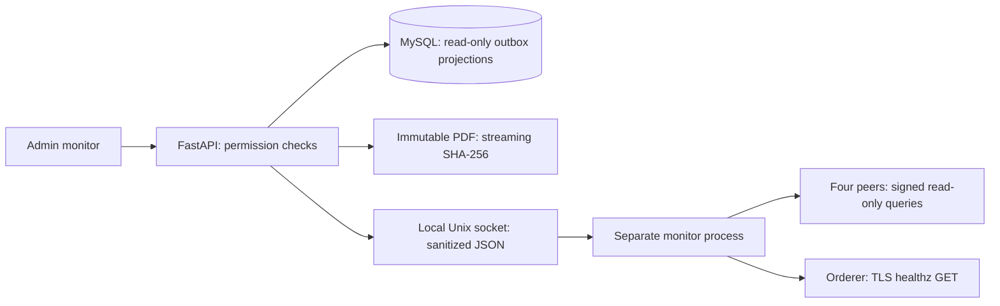

# Phase 9 — Blockchain Monitor & Explorer

Implemented as a feature alongside the existing Phase 8 integration. The UI is
`/#/administration/blockchain`, following the existing administration route and
HashRouter conventions. No production deployment, service restart, database
write, permission bootstrap, Fabric transaction, commit or push was performed.
The earlier Phase 9 E2E/signer scripts remain separate and unchanged by this feature.

## Architecture discovered and reused

The application releases/revokes reports in a MySQL transaction that captures
immutable `blockchain_event` records. A separate worker delivers that outbox via
the Node Fabric Gateway adapter to `labchain-anchor` on `labchain-channel`.
The repository pins Fabric 2.5.16. Peer1/peer2 belong to Org1MSP, peer3/peer4 to
Org2MSP, and all four peers plus the orderer run on one physical VPS.
`blockchain_node` contains logical node metadata, not live network observations.

Inspected the API, services, models, schemas, CLI, network configuration/scripts,
adapter, chaincode, frontend, tests, deployment units and existing documentation.
There is no `app/auth/` directory; authentication is in `app/api/auth.py`,
`app/dependencies/auth.py`, security and services.

Reused:

- Phase 8 `global_status` for outbox counts and worker activity; existing
  `/blockchain/status`, report/patient/public status semantics are unchanged.
- Existing cookie authentication, permission catalog, SYSTEM_ADMIN bypass,
  private routes with sanitized validation errors and `Cache-Control: no-store`.
- Gateway proposal construction, signing, credential validation, pinned gRPC
  and Fabric protobuf packages. Protobuf 0.3.7 is now an explicit dependency.
- Immutable release PDFs, safe storage-path validation, ReportVerification,
  canonical event validation and frozen report/event references.
- React Shell, permission guards, resource fetching, cards, badges, tables,
  timestamps and existing frontend test/build commands.



FastAPI never reads Fabric credentials, starts subprocesses, uses Docker, or
submits transactions. The monitor is a separate Unix service with its own
non-admin Org1 client identity. It needs no database credentials. Its request
protocol allows only overview, block page/detail, transaction and anchor reads.
It exposes no general query, endpoint, file path, command or mutation argument.

## Permissions and endpoints

Added catalog metadata only:

- `BLOCKCHAIN_EXPLORER_VIEW`: required by every explorer endpoint and page.
- `BLOCKCHAIN_INTEGRITY_VERIFY`: additionally required for integrity checks.

SYSTEM_ADMIN retains its existing bypass. No role is granted either permission,
and `BLOCKCHAIN_STATUS_VIEW` alone does not grant explorer access. Custom roles
explicitly granted the new permission can use the explorer. Existing frontend
patient routing still excludes patients from the staff workspace.

All endpoints below are **GET**, prefixed `/api/v1/admin/blockchain`. No explorer
mutation endpoint exists; CSRF is therefore unnecessary for these reads.

| Suffix | Result / limits |
| --- | --- |
| `/overview` | Four per-peer observations, channel, aggregate status, orderer signal and committed chaincode definition |
| `/queue` | Existing application outbox counts and worker activity, independently of Fabric |
| `/blocks?before=N&limit=10` | Descending exclusive block-number cursor; limit 1–10; source peer/time |
| `/blocks/{number}` | Header hashes and safe transaction IDs, validation codes/names, proposal timestamps |
| `/transactions/{transaction_id}` | QSCC lookup of the containing block, matched transaction, validation and block hash |
| `/anchors` | Keyset page, default 20/max 100; `before`, `status`, `event_type`, `block_number`, `transaction_id`, `entity_reference` filters |
| `/reports/{report_id}/integrity` | Read-only integrity result; requires both new permissions |

No schema migration was added or applied. Anchor pages use one explicit column
projection plus `limit + 1`, descending primary-key pagination, no OFFSET, no
COUNT and no N+1 queries. There are no ORM event loads for this list. The existing
outbox indexes support primary-key/status/entity workflows. Selective explorer
filters such as transaction ID and block number do not currently have dedicated
indexes; assess their query plans and add reviewed indexes before large-scale
history use. No entire ledger is loaded into memory.

## Fabric monitoring and node meanings

Each peer is addressed directly on its configured loopback TLS port:
peer1 7051, peer2 8051, peer3 9051, peer4 10051. Gateway SDK constructs the
proposal; the monitor signs it and calls that peer's Endorser `ProcessProposal`.
This avoids Gateway discovery evaluating on another peer and mislabeling its
height. Responses are never submitted to ordering. Queries are fixed:

Peer names and MSP labels come from the repository's fixed topology; they are
not a dynamic organization-discovery result. Reachability, membership, heights,
hashes and chaincode definition come from actual queries when configured.

- QSCC `GetChainInfo`: actual height, current hash and previous hash. Success
  proves the queried peer has access to that channel's ledger. No successful
  query means channel membership remains unknown, not false.
- QSCC `GetBlockByNumber` / `GetBlockByTxID`: bounded block and transaction reads.
- `_lifecycle QueryChaincodeDefinition`: observed committed version, sequence,
  and endorsement policy. A safe channel-policy reference is displayed; custom
  signature-policy principals/bytes are withheld. No configured version is
  substituted when the query fails.
- `LabchainAnchor:ReadAnchor`: fixed read used only by integrity verification.
- Orderer `https://127.0.0.1:9444/healthz`: TLS verification using its public CA;
  no admin certificate/key or participation mutation. A healthy response is a
  process/dependency signal, not proof of Raft consensus or write availability.
  No orderer ledger height is fabricated.

Per-peer gRPC deadlines and orderer timeout are 2.5 seconds. Peers are queried
concurrently and failures are retained individually. The monitor caps four
requests in flight; overview observations are cached for at most five seconds.
Socket requests cap at 2 KiB, replies at 1 MiB, the connection lifetime at
11 seconds; FastAPI applies a total 12-second socket budget and rejects evidence
older than 30 seconds or more than five seconds in the future. Oversized blocks
(over 8 MiB or 1,000 transactions), unsafe numeric values and malformed hashes
fail safely. Last successful peer query timestamps are kept in memory and reset
when the monitor restarts. No persistent monitoring history is claimed.

| State | Peer meaning |
| --- | --- |
| ONLINE | Successful direct channel query; height is at the highest observed height and its tip hash agrees with peers observed at that height |
| DEGRADED | Query rejected/failed after transport, lagging observed height, or conflicting observed tip hash |
| OFFLINE | Query transport unavailable or deadline exceeded; describes this probe, not proof the machine is powered off |
| UNKNOWN | No usable observation, missing/invalid configuration, or malformed evidence |

Aggregate ONLINE additionally requires all four peers ONLINE, orderer health
ONLINE and a successfully read committed definition. With usable peer evidence,
partial failures produce DEGRADED. All peer probes OFFLINE gives OFFLINE;
otherwise absent usable evidence gives UNKNOWN. Observations are not atomic:
a block committed between peer probes can temporarily produce a lag indication.
Worker IDLE has no effect on these states.

Fabric references used for protocol/health semantics:
[protocol definitions](https://hyperledger.github.io/fabric-protos/protos.html),
[Gateway signing API](https://hyperledger.github.io/fabric-gateway/main/api/node/interfaces/Gateway.html),
and [Fabric 2.5 operations service](https://hyperledger-fabric.readthedocs.io/en/release-2.5/operations_service.html).
The implementation also checks installed pinned SDK/protobuf code and tests
actual signed proposal bytes through a mocked Endorser transport.

## Ledger and privacy behavior

Block hashes are SHA-256 of the ASN.1 DER header, **not** hashes of serialized
protobuf blocks. Data hashes are checked against concatenated envelope bytes
before returning metadata. The genesis previous hash is null. Heights are block
counts; the latest number is height minus one. Numbers above JavaScript's exact
integer limit are rejected instead of rounded.

Only header metadata, transaction IDs, proposal timestamps and transaction
validation filter codes/names leave the monitor. Configuration transactions may
have no transaction ID. Missing validation metadata is UNKNOWN. VALID means the
transaction validation code is zero; it is separate from application outbox
CONFIRMED. Timestamps are proposal timestamps, not an ordering-service clock.
Queries currently use peer1 for ledger browsing and integrity; a peer1 failure
does not silently switch evidence source and returns unavailable/UNKNOWN.

No raw protobuf, read/write set, endorsement certificate, signature, canonical
payload, lease, raw exception, credential, clinical value or patient identity is
returned. Anchor pages use UUID references, not clinical names or internal
patient IDs. The frontend renders only declared fields, even if a malformed
server response contains extra properties. Hashes/IDs are abbreviated with
accessible copy controls and wrapping full-value disclosures.

## Integrity verification

The integrity endpoint accepts only the report ID. It never returns the PDF,
file path, verification token or canonical event. It:

1. Requires a RELEASED report and a unique authentic verification record.
2. Resolves the server-owned immutable PDF with existing path/symlink guards,
   reads a regular file in 64 KiB chunks (64 MiB cap), and detects observed file
   size/mtime changes during hashing.
3. Compares PDF SHA-256 with `report_verification.report_hash`.
4. Finds exactly one matching immutable REPORT_RELEASED event, verifies its
   canonical representation/hash, report version and artifact hash.
5. Reads the Fabric anchor and its committed transaction. Requires matching
   UUID, entity reference, event type, content/previous hashes, transaction ID,
   valid code zero, and recorded block number where present.

The PDF hash differs in meaning from `record_hash`: the latter hashes the
canonical event containing the artifact hash. It is the record hash that must
match Fabric's `content_hash`. Comparing the PDF directly to content_hash would
be incorrect.

Results: VERIFIED for the complete match; MISMATCH for observed differing
evidence; NOT_ANCHORED when no release outbox event exists or it is unconfirmed;
REPORT_NOT_RELEASED for generated/approved/revoked reports; FILE_MISSING for a
missing file; UNKNOWN for unavailable/inconsistent evidence, unsafe/unreadable
paths, oversized files, or unavailable Fabric. Missing report IDs return 404.
UNKNOWN must not be interpreted as a mismatch. No artifact/report mutation,
outbox event, audit verification row or Fabric submission is created. Normal
authentication/session behavior remains that of existing private API reads.
VERIFIED establishes artifact consistency against the observed peer, not
clinical correctness, independent consensus verification, or current release
status forever after the request.

## Files

New backend: `app/api/blockchain_monitor.py`,
`app/schemas/blockchain_monitor.py`,
`app/services/blockchain_monitor_client.py`,
`app/services/blockchain_monitor_service.py`.
Updated: `app/main.py`, `app/config.py`, `app/services/permission_catalog.py`.

New monitor: `blockchain/gateway-adapter/src/monitor.js`, `monitor-server.js`,
and `test/monitor.test.js`; updated adapter package manifest/lock and check script.
New deployment templates: `deploy/rhu-labchain-monitor.service` and
`deploy/blockchain-monitor.env.example`.

New frontend: `pages/BlockchainMonitor.tsx`, `components/HashValue.tsx`,
`types/monitor.ts`, `styles/monitor.css`, `test/monitor.test.tsx` under
`frontend/src`. Updated App routes, Shell navigation/title matching, main CSS.
New backend tests: `tests/test_phase9_monitor.py`; updated synthetic settings in
`tests/conftest.py`. This document is new. Earlier E2E/signer uncommitted files
and `.gitignore` changes predate this feature and were preserved.

## Validation

Commands (all synthetic; no production probes):

```bash
.venv/bin/python -m pytest tests/test_phase9_monitor.py tests/test_phase_8b_status.py -vv -ra --tb=long
cd frontend
npm test -- --run
npm run build
cd ../blockchain/gateway-adapter
npm test
npm run check
```

Backend: 72 passed, including RBAC, unknown versus idle, bounded filters,
projection privacy, PDF/ledger mismatches, missing file, unanchored report,
unsafe path, fresh evidence, socket errors and read-only SQL checks. The
existing 49 Phase 8 status tests pass unchanged. Two existing test dependency
deprecation warnings concern Starlette/httpx and AnyIO.

Frontend: all 208 tests passed (11 new monitor/hash tests), including permission
gates, partial/loading/error/empty states, network/queue separation, tables,
transaction lookup, filters, integrity GET, accessible labels and clipboard
success/failure. After correcting a test-only TypeScript query option, all 11
monitor tests were rerun and passed. Adapter/monitor: **57 passed**, including
signed QSCC proposal construction and finite transport timeout handling.
TypeScript/Vite build passed (1,917 modules; output remains local in `dist`).
Python compilation, Node syntax checks, `git diff --check`, and a separate
whitespace check of all 23 new source/docs/template files passed.

## Later deployment requirements — not performed

1. The dedicated non-admin OU=client Org1 **User2 source** has now been prepared
   using the new monitor-specific provisioner. See
   [monitor identity preparation](PHASE_9_MONITOR_IDENTITY.md) for preservation
   evidence and the separate, not-yet-run installer. Do not reuse the User1
   application provisioner or its runtime identity for this step.
   Preserve the existing validator's signcerts/cacerts structure. Private key
   ownership must be the new `rhu-labchain-monitor` user, 0600 in a 0700 parent.
   Supply only the public peer/orderer TLS CAs required by the env template.
   Do not copy peer, orderer, operator-admin or enrollment secrets to FastAPI.
2. Install pinned Node dependencies and the supplied hardened unit/env file.
   Create the monitor user/group. Grant the FastAPI service user access to the
   **socket group only**, not the private key directory. Runtime directory is
   0750; socket 0660. FastAPI remains outside Docker groups. The unit denies
   Docker sockets and network runtime/admin identity directories, and permits
   network traffic only to localhost.
3. Set FastAPI `BLOCKCHAIN_MONITOR_SOCKET=/run/rhu-labchain-monitor/monitor.sock`
   through its approved configuration. Unset it to leave live monitoring
   disabled; do not configure a URL or arbitrary path. Install/start services
   only during a separately authorized deployment.
4. Add the two metadata entries using the existing permission-catalog bootstrap
   (`python -m app.cli.bootstrap_permissions`) in that deployment. This does not
   grant permissions. Review role grants separately; do not run bootstrap_roles
   or grant broad administration privileges. SYSTEM_ADMIN needs no new grant.
5. Validate the deployed channel's QSCC/lifecycle/chaincode read ACLs and TLS
   CAs using read-only monitor requests. The multi-peer ports/topology match the
   repository, but no live probes or identity setup were run in this task.
6. Deploy the built frontend assets/index through the established backup and
   atomic replacement procedure; restart/reload the API as separately approved.
   Neither the blockchain worker nor Fabric requires code/config changes here.

The monitor process is read-only by its allowlisted implementation. Under the
current channel policies, a non-admin client identity may have wider Fabric
capabilities than this service exposes; do not claim the identity itself has a
cryptographically enforced read-only role. Unix socket ownership is the local
service trust boundary. Health and hash comparisons trust the authenticated
peer; they do not independently validate all block signatures or prove
multi-host resilience. Single-VPS limitations remain explicit in the UI.
